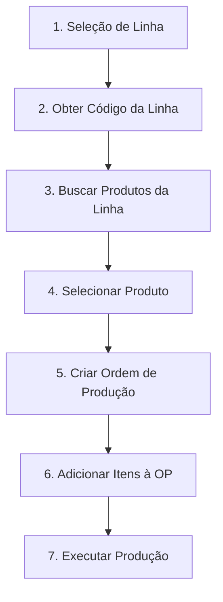

# API Prolink Facholi


## 📋 Visão Geral

API REST desenvolvida em Ruby on Rails para integração com sistemas ERP, gerenciamento de produtos, ordens de produção, equipamentos e informações relacionadas ao processo produtivo industrial.

### 🚀 Stack Tecnológica

| Tecnologia | Versão/Detalhes |
|------------|-----------------|
| **Framework** | Ruby on Rails 7.2 |
| **Ruby** | 3.4.5 |
| **Database** | SQL Server (dev/prod) / SQLite3 (testes) |
| **Autenticação** | HTTP Basic Auth via Devise |
| **Paginação** | Pagy gem |
| **Containerização** | Docker ready |
| **Service Objects** | Interactor pattern |

---

## 🏗️ Arquitetura da API

### 📁 Estrutura de Controllers

```
app/controllers/api/v1/
├── application_controller.rb              # Base controller com autenticação
├── erp_products_controller.rb            # Gestão de produtos ERP
├── erp_unity_measurements_controller.rb  # Unidades de medida
├── erp_model_general_controller.rb       # Modelos gerais
├── erp_model_items_controller.rb         # Itens de modelos
├── erp_operation_general_controller.rb   # Roteiros gerais
├── erp_operation_items_controller.rb     # Itens de roteiros
├── erp_production_orders_controller.rb   # Ordens de produção
├── erp_reason_stops_controller.rb        # Motivos de parada
├── erp_stop_groups_controller.rb         # Grupos de parada
├── erp_shifts_controller.rb              # Turnos de trabalho
├── erp_equipments_controller.rb          # Equipamentos
├── lines_controller.rb                   # Linhas de produção
└── contingencia/                         # Módulo de contingência
    ├── contingencia_products_controller.rb
    ├── contingencia_production_orders_controller.rb
    └── contingencia_model_items_controller.rb
```

### 📦 Estrutura de Models

```
app/models/
├── erp_product.rb                    # Produtos ERP com validações
├── erp_unity_measurement.rb          # Unidades de medida
├── erp_model_general.rb              # Modelos gerais
├── erp_model_item.rb                 # Itens de modelos
├── erp_operation_general.rb          # Roteiros gerais
├── erp_operation_item.rb             # Itens de roteiros
├── erp_production_order.rb           # Ordens de produção
├── erp_reason_stop.rb                # Motivos de parada
├── erp_stop_group.rb                 # Grupos de parada
├── erp_shift.rb                      # Turnos
├── erp_equipment.rb                  # Equipamentos
├── line.rb                           # Linhas de produção
├── contingencia_product.rb           # Produtos de contingência
├── contingencia_production_order.rb  # Ordens de contingência
└── contingencia_model_item.rb        # Itens de modelo contingência
```

---

## 🔐 Autenticação

A API utiliza **HTTP Basic Authentication** para proteger todos os endpoints.

### 🔑 Como Autenticar

#### Headers Necessários
```http
Authorization: Basic base64(email:password)
Content-Type: application/json
```

#### Credenciais Padrão (seeds.rb)
```yaml
Email: facholi@facholi.com
Password: adas32fav@#!32421
```

#### Exemplo de Requisição Autenticada
```bash
curl -X POST http://localhost:3000/api/v1/erp_products \
  -u "facholi@facholi.com:adas32fav@#!32421" \
  -H "Content-Type: application/json" \
  -d '{"erp_products": {"items": [...]}}'
```

> ⚠️ **IMPORTANTE**: TODOS os endpoints exigem autenticação
> - ✅ Todos os controllers herdam de `Api::V1::ApplicationController`
> - ✅ Todos incluem `before_action :authorize_user!`
> - ✅ Autenticação via HTTP Basic com validação de usuário/senha

---

## 📚 Endpoints da API

### 1. Produtos ERP (`ErpProducts`)

**Controller:** `Api::V1::ErpProductsController`  
**Model:** `ErpProduct`  
**Autenticação:** ✅ Obrigatória

#### `POST /api/v1/erp_products`
Cria ou atualiza produtos usando padrão upsert.

**Lógica do Controller:**
- Valida se `items` é um array
- Para cada produto, executa `find_or_initialize_by(cod_pro:)`
- Atualiza todos os atributos via `assign_attributes`
- Salva em transação isolada

**Request Body:**
```json
{
  "erp_products": {
    "items": [
      {
        "cod_pro": "PROD001",           // Obrigatório - máx 14 caracteres
        "des_pro": "Descrição Produto", // Obrigatório - máx 100 caracteres
        "cpl_pro": "Complemento",       // Opcional - máx 50 caracteres
        "uni_med": "KG",                // Obrigatório - máx 3 caracteres
        "cod_mod": "MOD001",            // Obrigatório - máx 14 caracteres
        "cod_rot": "ROT001",            // Obrigatório - máx 14 caracteres
        "cod_bar": "7891234567890",     // Opcional - máx 30 caracteres
        "des_teo": "Descrição Teórica", // Obrigatório - máx 50 caracteres
        "cod_cte": "CTE",               // Opcional - máx 3 caracteres
        "seq_ccp": "SEQ001"             // Opcional - máx 10 caracteres
      }
    ]
  }
}
```

**Response Success (200):**
```json
{
  "data": "Produtos processados com sucesso!"
}
```

#### `GET /api/v1/erp_products`
Lista todos os produtos com paginação.

**Funcionalidades:**
- Paginação via Pagy gem
- Ordenação por `created_at: :desc`
- Retorna metadados de paginação

**Response (200):**
```json
{
  "pagination": {
    "page": 1,
    "pages": 10,
    "count": 100,
    "prev": null,
    "next": 2
  },
  "data": [
    {
      "id": 1,
      "cod_pro": "PROD001",
      "des_pro": "Descrição do Produto",
      "cpl_pro": "Complemento",
      "uni_med": "KG",
      "cod_mod": "MOD001",
      "cod_rot": "ROT001",
      "cod_bar": "7891234567890",
      "des_teo": "Descrição Teórica",
      "cod_cte": "CTE",
      "seq_ccp": "SEQ001",
      "created_at": "2024-01-01T10:00:00.000Z",
      "updated_at": "2024-01-01T10:00:00.000Z"
    }
  ]
}
```

#### `GET /api/v1/erp_products/fetch_products_by_cod_linha`
Busca produtos por código de linha através de joins complexos.

**Query Parameter:** `cod_linha` (obrigatório)

**Lógica de Joins:**
```sql
JOIN erp_model_generals mg ON erp_products.cod_mod = mg.cod_mod
JOIN erp_model_items mi ON mi.cod_mod = mg.cod_mod  
JOIN equipment_lines el ON el.cod_eqp = mi.cod_balanca
WHERE el.cod_linha = ?
```

### 2. Unidades de Medida (`ErpUnityMeasurements`)

**Controller:** `Api::V1::ErpUnityMeasurementsController`  
**Model:** `ErpUnityMeasurement`  
**Autenticação:** ✅ Obrigatória

#### `POST /api/v1/erp_unity_measurements`
**Request Body:**
```json
{
  "erp_uom": {
    "items": [
      {
        "uni_med": "KG",        // Obrigatório - máx 14 caracteres
        "des_med": "Quilograma" // Obrigatório - máx 100 caracteres
      }
    ]
  }
}
```

#### `GET /api/v1/erp_unity_measurements`
Lista todas as unidades de medida.

### 3. Modelos Gerais (`ErpModelGeneral`)

**Controller:** `Api::V1::ErpModelGeneralController`  
**Model:** `ErpModelGeneral`  
**Autenticação:** ✅ Obrigatória

#### `POST /api/v1/erp_model_general`
**Lógica:** Upsert baseado em `cod_mod + ver_mod`

**Request Body:**
```json
{
  "erp_modelo": {
    "items": [
      {
        "cod_mod": "MOD001",             // Obrigatório - máx 14 caracteres
        "ver_mod": "1.0",                // Obrigatório - máx 10 caracteres
        "des_mod": "Descrição do Modelo",// Obrigatório - máx 100 caracteres
        "uni_med": "KG",                 // Obrigatório - máx 3 caracteres
        "dat_ini": "2024-01-01",         // Obrigatório - data de início
        "dat_fim": "2024-12-31",         // Obrigatório - data fim
        "qtd_bas": 100.5,                // Obrigatório - quantidade base
        "sit_mod": "A"                   // Obrigatório - situação (máx 1 caractere)
      }
    ]
  }
}
```

### 4. Itens do Modelo (`ErpModelItems`)

**Controller:** `Api::V1::ErpModelItemsController`  
**Model:** `ErpModelItem`  
**Autenticação:** ✅ Obrigatória

#### `POST /api/v1/erp_model_items`
**Lógica:** Upsert baseado em `cod_mod + ver_mod + seq_mod + cod_cmp`

**Request Body:**
```json
{
  "erp_modelo_itens": {
    "items": [
      {
        "cod_mod": "MOD001",     // Obrigatório - máx 14 caracteres
        "ver_mod": "1.0",        // Obrigatório - versão do modelo
        "seq_mod": 1,            // Obrigatório - sequência
        "cod_cmp": "COMP001",    // Obrigatório - código componente
        "qtd_uti": 10.5,         // Obrigatório - quantidade utilizada
        "cod_balanca": "BAL001"  // Obrigatório - código balança
      }
    ]
  }
}
```

### 5. Roteiro Geral (`ErpOperationGeneral`)

**Controller:** `Api::V1::ErpOperationGeneralController`  
**Model:** `ErpOperationGeneral`  
**Autenticação:** ✅ Obrigatória

#### `POST /api/v1/erp_operation_general`
**Request Body:**
```json
{
  "erp_roteiro_geral": {
    "items": [
      {
        "cod_rot": "ROT001",              // Obrigatório - máx 14 caracteres
        "ver_rot": "1.0",                 // Obrigatório - versão
        "des_rot": "Descrição do Roteiro",// Obrigatório - máx 100 caracteres
        "qtd_base": 100.0,                // Obrigatório - quantidade base
        "lot_tec": "LOTE001"              // Obrigatório - lote técnico
      }
    ]
  }
}
```

### 6. Itens do Roteiro (`ErpOperationItems`)

**Controller:** `Api::V1::ErpOperationItemsController`  
**Model:** `ErpOperationItem`  
**Autenticação:** ✅ Obrigatória

#### `POST /api/v1/erp_operation_items`
**Request Body:**
```json
{
  "erp_roteiro_itens": {
    "items": [
      {
        "cod_rot": "ROT001",  // Obrigatório - máx 14 caracteres
        "ver_rot": "1.0",     // Obrigatório - versão
        "seq_rot": 1,         // Obrigatório - sequência
        "tmp_fix": 30.5,      // Obrigatório - tempo fixo
        "tmp_prp": 15.2,      // Obrigatório - tempo proporcional
        "cod_cre": "CRE001"   // Obrigatório - código CRE (máx 8 caracteres)
      }
    ]
  }
}
```

### 7. Ordens de Produção (`ErpProductionOrders`)

**Controller:** `Api::V1::ErpProductionOrdersController`  
**Model:** `ErpProductionOrder`  
**Autenticação:** ✅ Obrigatória

#### `POST /api/v1/erp_production_orders`
**Lógica:** Upsert baseado em `num_orp` (número único da OP)

**Request Body:**
```json
{
  "erp_ordem_prod": {
    "items": [
      {
        "cod_ori": "ORI",          // Obrigatório - origem (máx 3 caracteres)
        "num_orp": 123456,         // Obrigatório - número da OP (único)
        "des_orp": "Descrição OP", // Obrigatório - máx 50 caracteres
        "cod_pro": "PROD001",      // Obrigatório - código produto
        "cod_mod": "MOD001",       // Obrigatório - código modelo
        "cod_rot": "ROT001",       // Obrigatório - código roteiro
        "ver_mod": "1.0",          // Obrigatório - versão modelo
        "ver_rot": "1.0",          // Obrigatório - versão roteiro
        "dat_emi": "2024-01-01",   // Obrigatório - data emissão
        "dat_ent": "2024-01-31",   // Obrigatório - data entrega
        "qtd_prd": 1000.0,         // Obrigatório - quantidade produzir
        "num_pri": 1,              // Obrigatório - prioridade
        "qtd_bat": 100.0           // Obrigatório - quantidade batch
      }
    ]
  }
}
```

### 8. Motivos de Parada (`ErpReasonStops`)

**Controller:** `Api::V1::ErpReasonStopsController`  
**Model:** `ErpReasonStop`  
**Autenticação:** ✅ Obrigatória

#### `POST /api/v1/erp_reason_stops`
**Request Body:**
```json
{
  "erp_motivos_parada": {
    "items": [
      {
        "cod_gru": "GRP001",               // Obrigatório - código grupo
        "cod_mtv": "M01",                  // Obrigatório - código motivo
        "des_mtv": "Manutenção Preventiva",// Obrigatório - descrição
        "abr_mtv": "MP",                   // Opcional - abreviação
        "par_lin": true,                   // Opcional - parada linha
        "tip_par": "TIPO1",                // Opcional - tipo parada
        "sit_mtv": "A"                     // Obrigatório - situação
      }
    ]
  }
}
```

### 9. Grupos de Parada (`ErpStopGroups`)

**Controller:** `Api::V1::ErpStopGroupsController`  
**Model:** `ErpStopGroup`  
**Autenticação:** ✅ Obrigatória

#### `POST /api/v1/erp_stop_groups`
**Request Body:**
```json
{
  "erp_grupo_parada": {
    "items": [
      {
        "cod_gru": "GRP001",        // Obrigatório - código
        "des_gru": "Grupo Manutenção",// Obrigatório - descrição
        "abr_gru": "MAN"            // Obrigatório - abreviação
      }
    ]
  }
}
```

### 10. Turnos (`ErpShifts`)

**Controller:** `Api::V1::ErpShiftsController`  
**Model:** `ErpShift`  
**Autenticação:** ✅ Obrigatória

#### `POST /api/v1/erp_shifts`
**Request Body:**
```json
{
  "erp_turno": {
    "items": [
      {
        "cod_turno": "T01",         // Obrigatório - código
        "des_turno": "Turno Manhã", // Obrigatório - descrição
        "hora_ini": "06:00",        // Obrigatório - hora início
        "hora_fim": "14:00",        // Obrigatório - hora fim
        "dia": "Segunda-Sexta",     // Obrigatório - dias
        "tipo": "Normal"            // Obrigatório - tipo
      }
    ]
  }
}
```

### 11. Equipamentos (`ErpEquipments`)

**Controller:** `Api::V1::ErpEquipmentsController`  
**Model:** `ErpEquipment`  
**Autenticação:** ✅ Obrigatória

#### `POST /api/v1/erp_equipments`
**Request Body:**
```json
{
  "erp_equipamento": {
    "items": [
      {
        "cod_rec": "REC001",         // Obrigatório - código recurso
        "cod_eqp": "EQP001",         // Obrigatório - código equipamento
        "des_cre": "Centro Recurso", // Obrigatório - descrição centro
        "des_eqp": "Equipamento 01", // Obrigatório - descrição equip.
        "eqp_pai": "EQP000",         // Opcional - equipamento pai
        "eqp_pri": "EQP001"          // Opcional - equipamento principal
      }
    ]
  }
}
```

### 12. Linhas de Produção (`Lines`)

**Controller:** `Api::V1::LinesController`  
**Model:** `Line`  
**Autenticação:** ✅ Obrigatória

#### `GET /api/v1/lines`
Lista todas as linhas de produção.

**Funcionalidades:**
- Endpoint somente leitura
- Sem paginação (retorna todos os registros)

**Response (200):**
```json
{
  "data": [
    {
      "id": 1,
      "cod_linha": "L001",
      "des_linha": "Linha de Produção 1",
      "capacidade": 1000,
      "status": "ATIVA",
      "created_at": "2024-01-01T10:00:00.000Z",
      "updated_at": "2024-01-01T10:00:00.000Z"
    }
  ]
}
```

---

## 🚨 Módulo de Contingência

### 🎯 Visão Geral

O módulo de contingência permite operação independente do ERP principal, garantindo continuidade operacional.

### 📋 Fluxo de Contingência



### 📝 Fluxo Detalhado

#### **1️⃣ PASSO 1: Listar Linhas Disponíveis**

```bash
GET /api/v1/lines
```

**Response:**
```json
{
  "data": [
    {
      "id": 1,
      "cod_linha": "L001",
      "des_linha": "Linha de Produção 1",
      "capacidade": 1000,
      "status": "ATIVA"
    },
    {
      "id": 2,
      "cod_linha": "L002",
      "des_linha": "Linha de Produção 2",
      "capacidade": 800,
      "status": "ATIVA"
    }
  ]
}
```

#### **2️⃣ PASSO 2: Buscar Produtos por Linha**

```bash
GET /api/v1/erp_products/fetch_products_by_cod_linha?cod_linha=L001
```

**Lógica de Relacionamento:**
- Conecta produtos → modelos gerais → itens de modelo → equipamentos → linhas

**Response:**
```json
{
  "pagination": {
    "page": 1,
    "pages": 5,
    "count": 50,
    "prev": null,
    "next": 2
  },
  "data": [
    {
      "id": 1,
      "cod_pro": "PROD001",
      "des_pro": "Produto da Linha L001",
      "uni_med": "KG",
      "cod_mod": "MOD001",
      "cod_rot": "ROT001",
      "des_teo": "Produto para linha automatizada"
    }
  ]
}
```

#### **3️⃣ PASSO 3: Criar Produto de Contingência (Opcional)**

```bash
POST /api/v1/contingencia/contingencia_products
```

**Request:**
```json
{
  "contingencia_produto": {
    "cod_pro": "CONT_PROD001",
    "des_pro": "Produto de Contingência",
    "uni_med": "KG"
  }
}
```

**Validações:**
- ✅ Verifica se a unidade de medida existe em `erp_unity_measurements`
- ✅ Código do produto deve ser único
- ✅ Todos os campos são obrigatórios

#### **4️⃣ PASSO 4: Criar Ordem de Produção de Contingência**

```bash
POST /api/v1/contingencia/contingencia_production_orders
```

**Request:**
```json
{
  "contingencia_ordem_prod": {
    "num_orp": 999001,
    "cod_linha": "L001",
    "cod_pro": "PROD001",
    "qtd_prd": 5000.0,
    "qtd_bat": 100.0
  }
}
```

**Status da OP:**

| Status | Código | Descrição |
|--------|--------|-----------|
| `PENDENTE` | 0 | Status inicial automático |
| `RODANDO` | 1 | Em produção |
| `FINALIZADA` | 2 | Concluída |
| `CANCELADA` | 3 | Cancelada |

#### **5️⃣ PASSO 5: Adicionar Itens à Ordem de Produção**

```bash
POST /api/v1/contingencia/contingencia_model_items
```

**Request:**
```json
{
  "contingencia_itens_ordem_prod": {
    "items": [
      {
        "num_orp": 999001,
        "cod_cmp": "COMP001",
        "seq_mod": 1,
        "qtd_uti": 10.5,
        "cod_balanca": "BAL001",
        "origem": "CONTINGENCIA"
      },
      {
        "num_orp": 999001,
        "cod_cmp": "COMP002",
        "seq_mod": 2,
        "qtd_uti": 20.0,
        "cod_balanca": "BAL002",
        "origem": "CONTINGENCIA"
      }
    ]
  }
}
```

### 🎯 Vantagens do Sistema de Contingência

| Vantagem | Descrição |
|----------|-----------|
| **✅ Operação Independente** | Funciona mesmo com ERP offline, não depende de conectividade externa |
| **✅ Rastreabilidade Completa** | Campo "origem" identifica itens de contingência, histórico completo |
| **✅ Flexibilidade Operacional** | Permite criar produtos emergenciais e OPs de contingência |
| **✅ Integração Futura** | Dados podem ser sincronizados posteriormente com ERP |

### 📊 Endpoints do Módulo de Contingência

#### 13. Produtos de Contingência (`ContingenciaProducts`)

**Controller:** `Api::V1::Contingencia::ContingenciaProductsController`  
**Model:** `ContingenciaProduct`  
**Service:** `ContingenciaProductService::CreateContingenciaProduct`

#### 14. Ordens de Produção de Contingência (`ContingenciaProductionOrders`)

**Controller:** `Api::V1::Contingencia::ContingenciaProductionOrdersController`  
**Model:** `ContingenciaProductionOrder`  
**Service:** `ContingenciaProductionOrderService::CreateContingenciaProductionOrder`

#### 15. Itens de Modelo de Contingência (`ContingenciaModelItems`)

**Controller:** `Api::V1::Contingencia::ContingenciaModelItemsController`  
**Model:** `ContingenciaModelItem`

---

## 🔄 Fluxo Completo - Exemplo Prático

### Cenário: Criação de uma OP de Contingência para Linha L001

```bash
# 1. Buscar Linhas Disponíveis
curl -X GET http://localhost:3000/api/v1/lines \
  -u "facholi@facholi.com:adas32fav@#!32421"

# 2. Buscar Produtos da Linha L001
curl -X GET "http://localhost:3000/api/v1/erp_products/fetch_products_by_cod_linha?cod_linha=L001" \
  -u "facholi@facholi.com:adas32fav@#!32421"

# 3. Criar Ordem de Produção de Contingência
curl -X POST http://localhost:3000/api/v1/contingencia/contingencia_production_orders \
  -u "facholi@facholi.com:adas32fav@#!32421" \
  -H "Content-Type: application/json" \
  -d '{
    "contingencia_ordem_prod": {
      "num_orp": 999001,
      "cod_linha": "L001",
      "cod_pro": "PROD001",
      "qtd_prd": 5000.0,
      "qtd_bat": 100.0
    }
  }'

# 4. Adicionar Componentes à OP
curl -X POST http://localhost:3000/api/v1/contingencia/contingencia_model_items \
  -u "facholi@facholi.com:adas32fav@#!32421" \
  -H "Content-Type: application/json" \
  -d '{
    "contingencia_itens_ordem_prod": {
      "items": [
        {
          "num_orp": 999001,
          "cod_cmp": "COMP001",
          "seq_mod": 1,
          "qtd_uti": 10.5,
          "cod_balanca": "BAL001",
          "origem": "CONTINGENCIA"
        }
      ]
    }
  }'

# 5. Verificar OP Criada
curl -X GET http://localhost:3000/api/v1/contingencia/contingencia_production_orders \
  -u "facholi@facholi.com:adas32fav@#!32421"
```

---

## 🛡️ Validações e Regras de Negócio

### Módulo de Contingência

#### `ContingenciaProduct`
```ruby
validates :cod_pro, :uni_med, presence: true
validates :cod_pro, uniqueness: true
validate :uom_exists  # Valida se unidade existe em ErpUnityMeasurement
```

#### `ContingenciaProductionOrder`
```ruby
validates :num_orp, :cod_pro, :cod_linha, :qtd_prd, :qtd_bat, presence: true
validates :num_orp, uniqueness: true
validate :product_exists  # Valida se produto existe em ErpProduct
validate :line_exists     # Valida se linha existe em Line

enum status: {
  PENDENTE: '0',
  RODANDO: '1',
  FINALIZADA: '2',
  CANCELADA: '3'
}
```

---

## 📊 Padrões de Response

### ✅ Respostas de Sucesso

| Tipo | Status | Response |
|------|--------|----------|
| **Criação/Atualização** | 200 | `{"data": "Mensagem de sucesso específica"}` |
| **Criação com Service** | 201 | `{"data": "Recurso cadastrado com sucesso!"}` |
| **Listagem Simples** | 200 | `{"data": [...]}` |
| **Listagem com Paginação** | 200 | `{"pagination": {...}, "data": [...]}` |

### ❌ Respostas de Erro

| Tipo | Status | Response |
|------|--------|----------|
| **Autenticação** | 401 | `{"error": "Credenciais inválidas!"}` |
| **Validação** | 400 | `{"error": "O atributo items deve ser um vetor!"}` |
| **Processamento** | 422 | `{"error": "Mensagem específica do service"}` |
| **Erro Interno** | 500 | `{"error": "Mensagem de erro ActiveRecord"}` |

---

## 🗄️ Configuração do Banco de Dados

### 💻 Desenvolvimento
```yaml
adapter: sqlserver
host: localhost
database: SUPERVISORIO_LINK
username: sa
password: Gr@fcet01
```

### 🧪 Teste
```yaml
adapter: sqlite3
database: storage/test.sqlite3
```

### 🚀 Produção
```yaml
adapter: sqlserver
ssl: enabled (config.force_ssl = true)
# Use variáveis de ambiente:
DATABASE_HOST=seu_host
DATABASE_NAME=seu_banco
DATABASE_USER=seu_usuario
DATABASE_PASSWORD=sua_senha
```

---

## 📝 Observações Importantes

### 🔧 Lógica de Processamento

| Padrão | Descrição |
|--------|-----------|
| **Upsert Pattern** | Maioria dos endpoints ERP utilizam `find_or_initialize_by` |
| **Processamento em Lote** | Todos os endpoints aceitam arrays no campo `items` |
| **Transações** | Cada item é processado em transação isolada |
| **Service Objects** | Módulo de contingência utiliza Service Objects |
| **Validações** | Aplicadas em nível de Model com mensagens detalhadas |

### 📋 Requisitos de Requisição

- `Content-Type: application/json` obrigatório
- `Authorization: HTTP Basic Auth` em todos os endpoints
- CSRF: Desabilitado para API controllers

## 🚀 Instalação e Setup

### 📦 Pré-requisitos

- Ruby 3.4.5
- Rails 7.2+
- SQL Server (desenvolvimento/produção)
- Bundler

### 🛠️ Passo a Passo

#### 1. Clone o repositório
```bash
git clone [seu-repositorio]
cd prolink-facholi
```

#### 2. Instale as dependências
```bash
bundle install
```

#### 3. Configure o banco de dados
```bash
# Copie e ajuste as credenciais do banco
cp config/database.yml.example config/database.yml

# Crie o banco e rode as migrations
rails db:create
rails db:migrate
```

#### 4. Popule o banco com dados iniciais
```bash
rails db:seed
# Isso criará o usuário padrão: facholi@facholi.com
```

#### 5. Inicie o servidor
```bash
rails server
# API disponível em http://localhost:3000
```

---

## 🐳 Docker

O projeto inclui Dockerfile para deployment:

```bash
# Build da imagem
docker build -t prolink-facholi .

# Executar container
docker run -d -p 3000:3000 \
  -e RAILS_MASTER_KEY=[sua_master_key] \
  -e DATABASE_HOST=[seu_host] \
  -e DATABASE_NAME=[seu_banco] \
  -e DATABASE_USER=[seu_usuario] \
  -e DATABASE_PASSWORD=[sua_senha] \
  prolink-facholi
```

---

## 💻 Exemplos de Uso com cURL

### 🔑 Autenticação Base
```bash
# Todas as requisições devem incluir:
-u "facholi@facholi.com:adas32fav@#!32421"
```

### 📦 Criar Produtos
```bash
curl -X POST http://localhost:3000/api/v1/erp_products \
  -u "facholi@facholi.com:adas32fav@#!32421" \
  -H "Content-Type: application/json" \
  -d '{
    "erp_products": {
      "items": [{
        "cod_pro": "PROD001",
        "des_pro": "Produto Teste",
        "uni_med": "KG",
        "cod_mod": "MOD001",
        "cod_rot": "ROT001",
        "des_teo": "Descrição Teórica"
      }]
    }
  }'
```

### 📏 Listar Unidades de Medida
```bash
curl -X GET http://localhost:3000/api/v1/erp_unity_measurements \
  -u "facholi@facholi.com:adas32fav@#!32421"
```

### 📋 Criar Ordem de Produção
```bash
curl -X POST http://localhost:3000/api/v1/erp_production_orders \
  -u "facholi@facholi.com:adas32fav@#!32421" \
  -H "Content-Type: application/json" \
  -d '{
    "erp_ordem_prod": {
      "items": [{
        "cod_ori": "ORI",
        "num_orp": 123456,
        "des_orp": "OP Teste",
        "cod_pro": "PROD001",
        "cod_mod": "MOD001",
        "cod_rot": "ROT001",
        "ver_mod": "1.0",
        "ver_rot": "1.0",
        "dat_emi": "2024-01-01",
        "dat_ent": "2024-01-31",
        "qtd_prd": 1000,
        "num_pri": 1,
        "qtd_bat": 100
      }]
    }
  }'
```

---

## 📦 Estrutura de Tabelas Adicionais

### Tabelas de Contingência
- `contingencia_production_orders` - Ordens de produção de contingência
- `contingencia_model_items` - Itens de modelo de contingência
- `contingencia_products` - Produtos de contingência

### Tabelas de Produção
- `bateladas` - Controle de bateladas de produção
- `batelada_passos` - Passos/etapas de cada batelada
- `lines` - Linhas de produção
- `equipment_lines` - Relação equipamento-linha
- `line_stops` - Paradas de linha

### Tabelas de Ensacamento
- `bagging_stops` - Paradas de ensacadeira
- `bagging_weights` - Pesos de ensacamento

---

## 🔧 Troubleshooting

### ❌ Erro de Autenticação
```json
{"error": "Credenciais inválidas!"}
```
**Solução:** Verifique se está usando as credenciais corretas do seeds.rb

### ❌ Erro de Validação
```json
{"error": "O atributo items dos [recurso] deve ser um vetor!"}
```
**Solução:** Certifique-se de enviar um array no campo items

### ❌ Erro de Database
Se encontrar erros de conexão com SQL Server:
1. Verifique se o SQL Server está rodando
2. Confirme as credenciais em `config/database.yml`
3. Teste a conexão: `rails db:migrate`

### ❌ Erro de Service Object
```json
{"error": "Unidade de Medida não encontrada!"}
```
**Solução:** Para contingência, certifique-se que a unidade de medida existe em `ErpUnityMeasurement`

---

## 📊 Métricas e Monitoramento

### 📝 Logs
- **Desenvolvimento:** Console output
- **Produção:** `log/production.log` ou STDOUT (Docker)

### 🏥 Health Check
```bash
curl http://localhost:3000/up
```

---

## 🔮 Próximas Features

- [ ] Versionamento de API (v2)
- [ ] Rate limiting
- [ ] Swagger/OpenAPI documentation
- [ ] WebSocket support para real-time updates
- [ ] Correção dos bugs identificados
- [ ] Implementação de soft deletes
- [ ] Auditoria de mudanças
- [ ] Cache Redis para consultas frequentes
- [ ] Dashboard de monitoramento de contingência
- [ ] Sincronização automática com ERP principal
- [ ] Relatórios de operações de contingência

---

## 📄 Licença

Proprietary - Todos os direitos reservados

---

## 👥 Suporte

Para questões e suporte, entre em contato com a equipe de desenvolvimento.